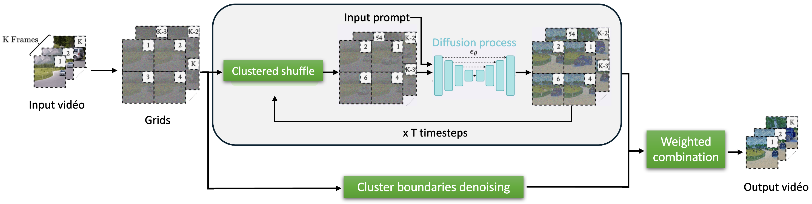

# Lightweight text-to-video editing for data augmentation of driving videos

## Abstract
The reliable operation of Advanced Driver-Assistance Systems (ADAS) critically depends on robust object detection from onboard camera footage, necessitating validation over millions of kilometers of driving scenarios. Thus, to effectively test and stress-test these systems, it is highly valuable to employ data augmentation techniques by editing real-world driving videos. State-of-the-art video editing methods struggle to generate realistic, smooth videos in a lightweight manner. To address this issue, we propose a novel zero-shot text-to-video editing method that leverages a pretrained diffusion model to generate rare driving scenarios from textual prompts. By employing a stochastic clustered shuffling approach over spatial grids, our method enables the editing of long, complex driving videos without training or fine-tuning, while generating high-quality, realistic, and diverse scenarios. To the best of our knowledge, this is the first work to validate video editing techniques for ADAS on the BDD100K real-world dataset using extended video sequences of over 350 frames, significantly longer than previous baselines, and to assess the edited videos using object detection and tracking metrics. Therefore, this work contributes to the development of text-to-video editing that results in superior object detection and tracking performance compared to the current state-of-the-art techniques, while maintaining computational efficiency suitable for large-scale validation scenarios.

## Method overview

## Results
The `video_results` directory provides generated videos of our method against baselines on BDD100K driving dataset, with Grounded Sam 2 object detections aggregated in three classes 'vehicle', 'VRU' and 'traffic sign'.
